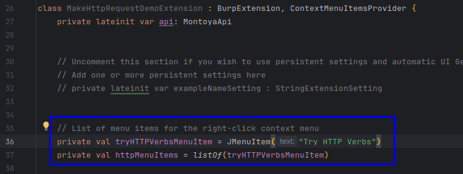
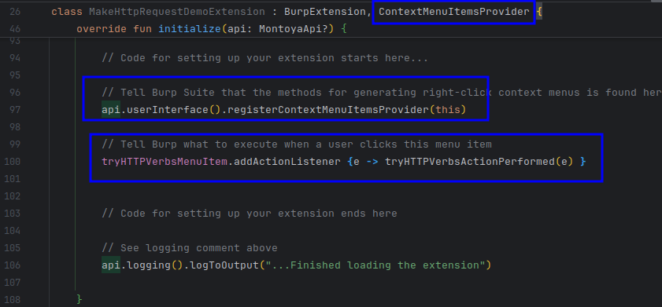
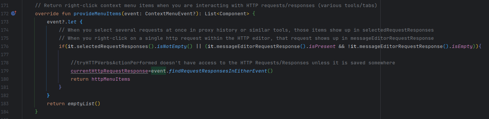
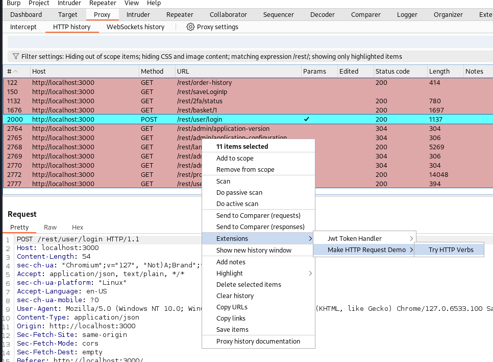
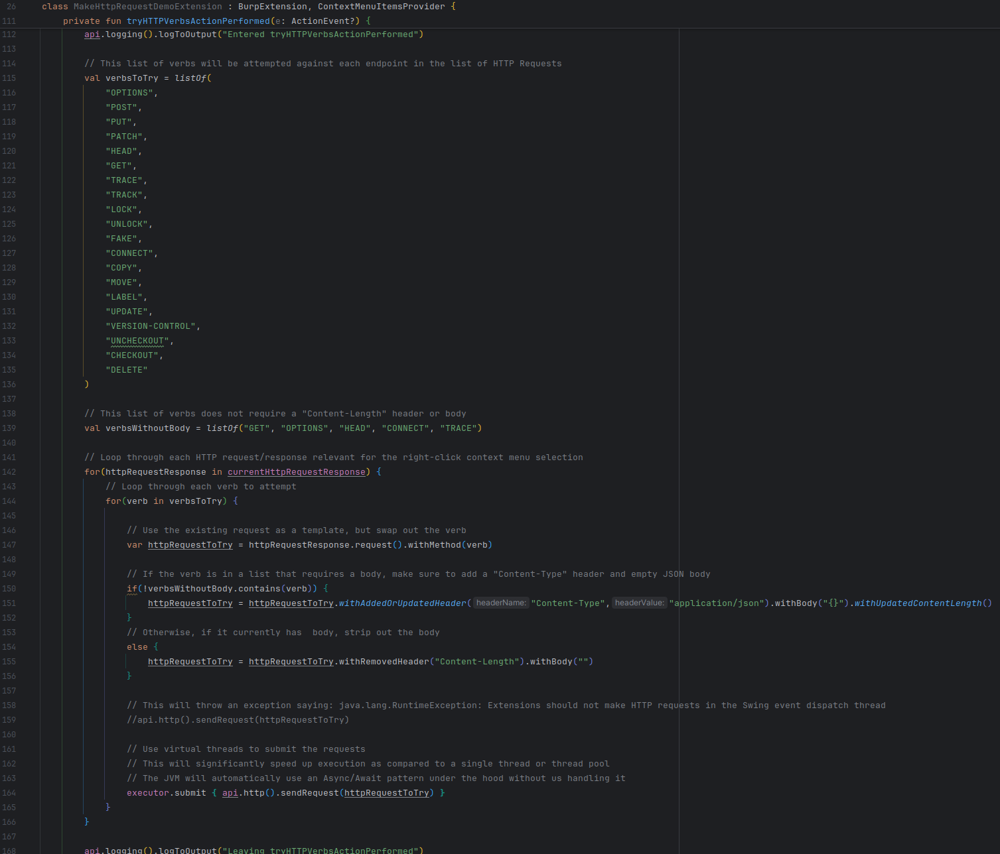
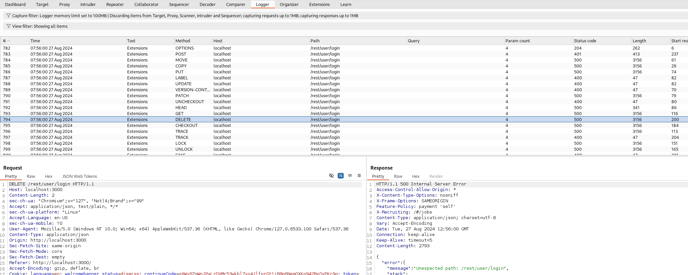

# Make HTTP Request Demo

_By [Nick Coblentz](https://www.linkedin.com/in/ncoblentz/)_

__This Burp Extension is made possible by [Virtue Security](https://www.virtuesecurity.com), the Application Penetration Testing consulting company I work for.__

When testing applications with Burp Suite, you often send quite a few of the same test cases every assessment. Those test cases can't be automated into a scanner check or BCheck because you want to analyze the response from the application manually. You are looking for abnormalities or interesting responses, not just vulnerabilities. Use of intruder is one common way to iterate through a lot of attack payloads, but requires setup for each test case. Since these test cases are repeated each assessment, it's better to use a right-click context menu after selecting one or more requests and choosing a test suite you would like to run. Then, the results can be reviewed in the logger tab. During analysis, you can filter some of those results or extract data using Bambdas as well. 

This project demonstrates how to create one of those test cases. This one focuses on iterating through a list of HTTP verbs when testing REST services. It also demonstrates use of Java Virtual Threads to send a large number of asynchronous requests so your test cases complete quickly. 

Concepts:
1. Create a right-click context menu
2. Issue new HTTP Requests
3. Use Java 21 Virtual Threads

## Setup

This project was initially created using the template found at: https://github.com/ncoblentz/KotlinBurpExtensionBase. That template's README.md describes how to:
- Build this and other projects based on the template
- Load the built jar file in Burp Suite
- Debug Burp Suite extensions using IntelliJ
- Provides links to documentation for building Burp Suite Plugins

## Walkthrough

### Set Up Right-Click Context Menu

First, define a `JMenuItem` that contains the text you wish to see in the right-click context menu.

Next, tell Burp Suite that you want to expose a right-click context menu `registerContextMenuItemsProvider` and that the current class with expose a function called `provideMenuItems` (assumed based on the interface). Burp Suite will run this method every time you right-click on an item in the tool to decide whether to show the menu item. 

Then, attach an `actionListener` to that menu item to handle the user clicking on it. Every time the user clicks on the menu item it will execute `tryHTTPverbsActionPerformed`.

### Provide Menu Items

When the user right-clicks, the method below will execute. Show a menu item if the use selects one or more requests from an HTTP history or if the user right-clicks on a single request exposed through an HTTP Request/Response editor. When that occurs, store the referenced requests in a property, so it can be accessed by other functions. 

### Action Performed (User Clicked the Menu Item)

Once the user clicks the menu item, execute the test case. This test case creates a list of HTTP verbs to attempt, and iterates through all the verbs for each HTTP Request. There's some additional logic related to whether a particular verb is allowed to have a body and needs a `Content-Length` HTTP header. After creating each test case, it is sent using Java 21 Virtual Threads. The results can be viewed inside Burp Suite in the Logger tab.

### Viewing the Results

Use the logger tab to filter (using Bambdas) the results and look for interesting responses.

